# KYB & Financial Risk Assessment System (Azure)

This repository contains Company KYB onboarding and deterministic financial risk assessment solution/POC on Azure, designed for regulated environments with explainability, auditability, and secure-by-default controls.

## Architecture Diagram

The architecture diagram is included below and used as the primary design artifact:

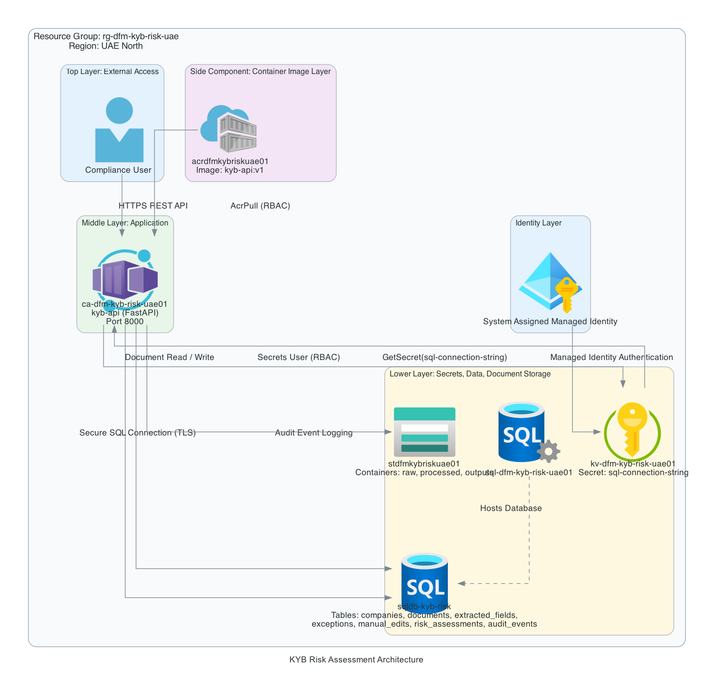

## Demo Video

[Watch Demo Video](DemoVideo.mp4)

## Implementation Evidence (Screenshots)

### Azure Implementation

#### Resource Group And Deployed Services
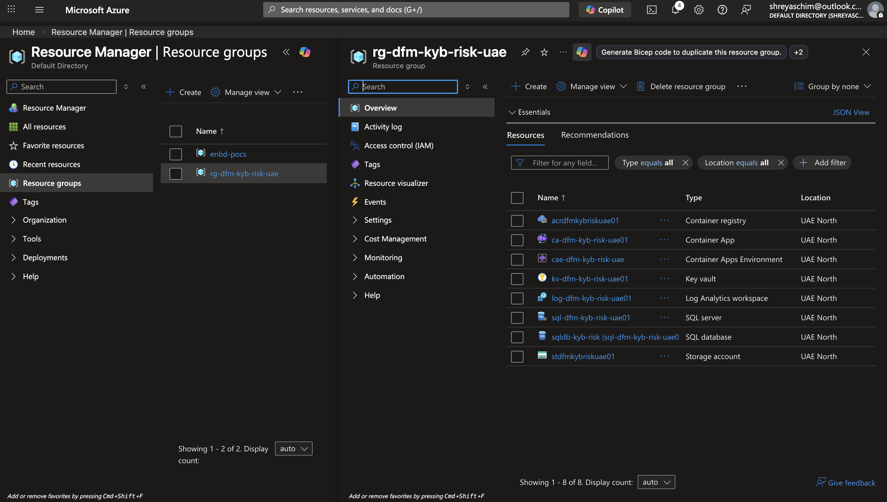

#### Azure Container App Configuration
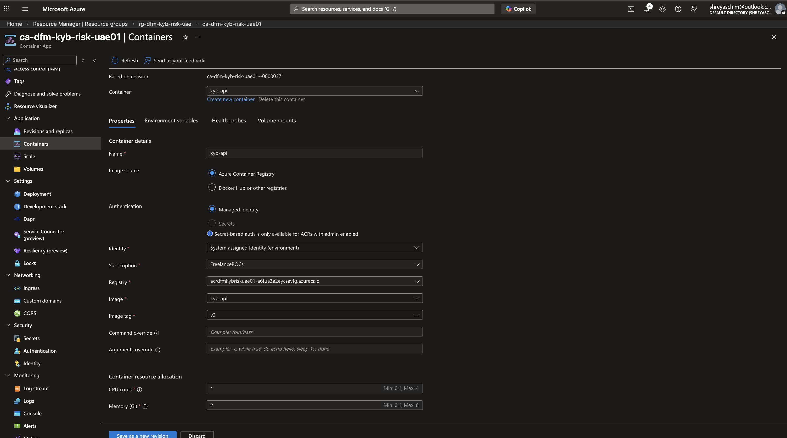

#### Azure Container App Log Monitor
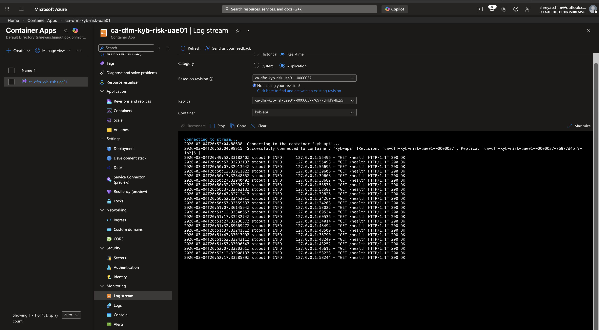

#### Azure Key Vault Secrets And Access Policies
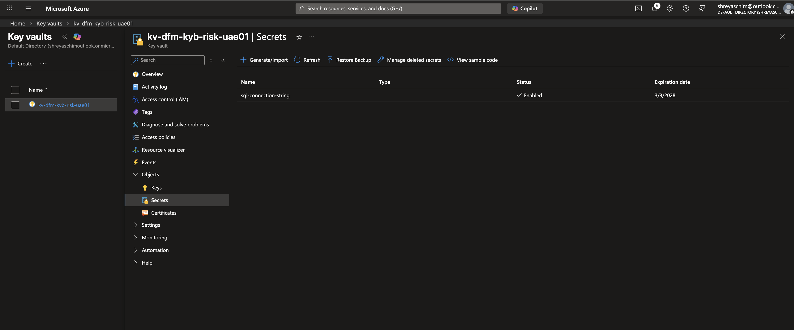

#### Azure SQL Server And Database Configuration
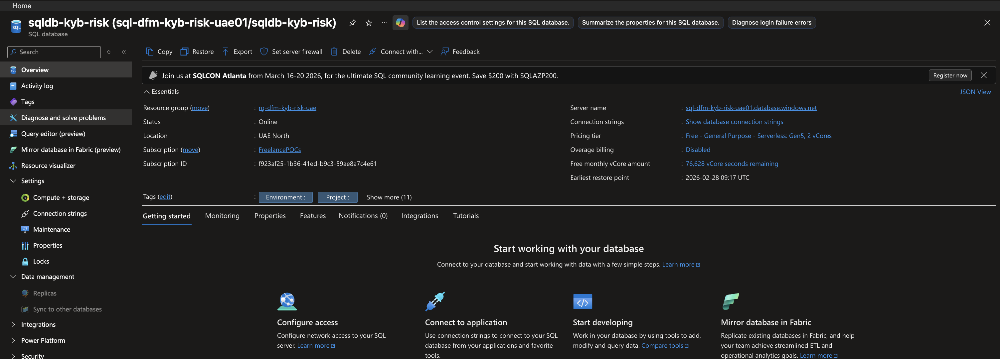

#### Azure Storage Account Configuration
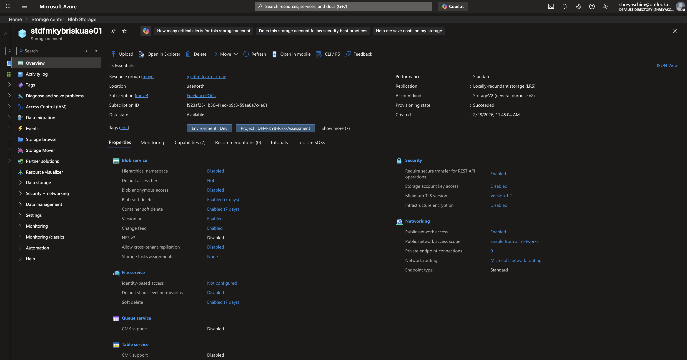

#### Azure Container Registry And Images
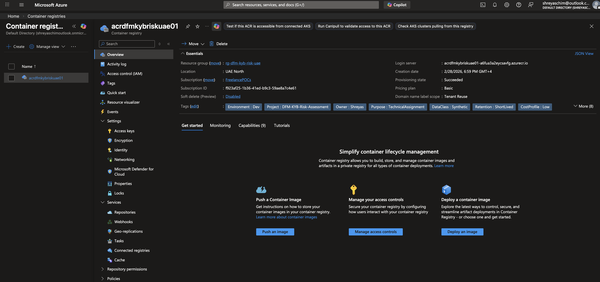
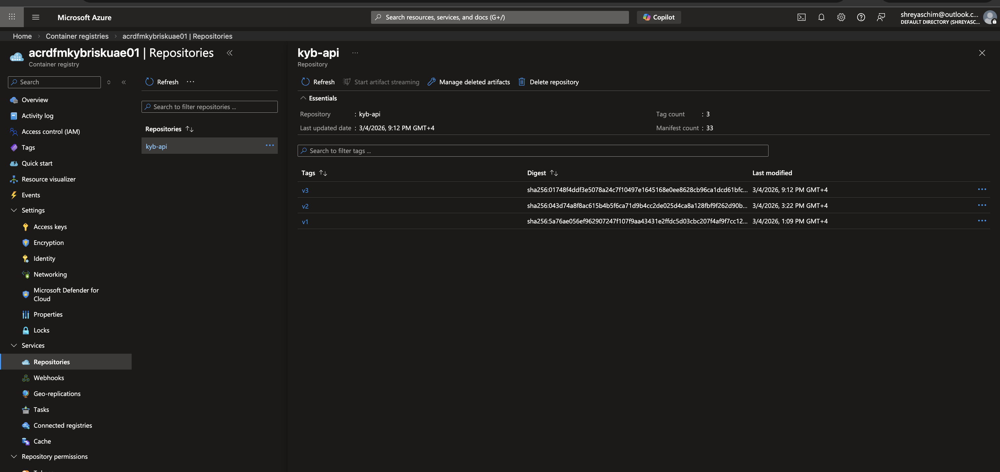

#### Application Insights Overview


### Application UI Evidence

#### Review Page (Cited Documents List)
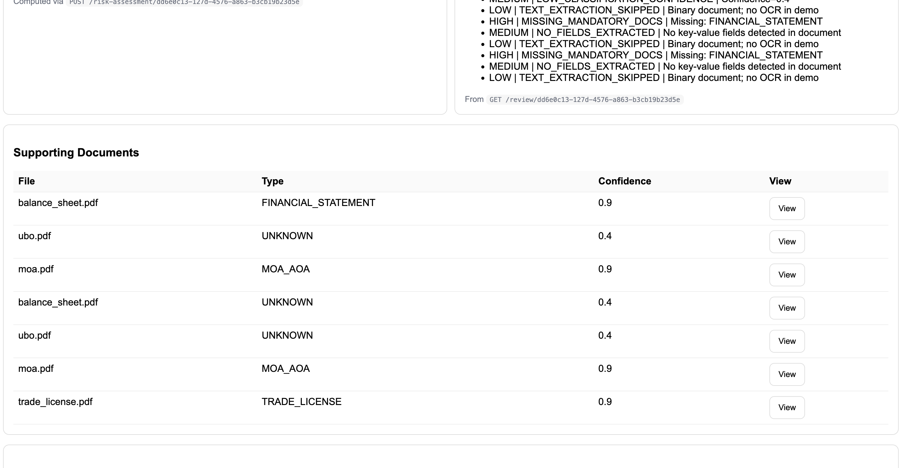

#### Document Viewer Popup
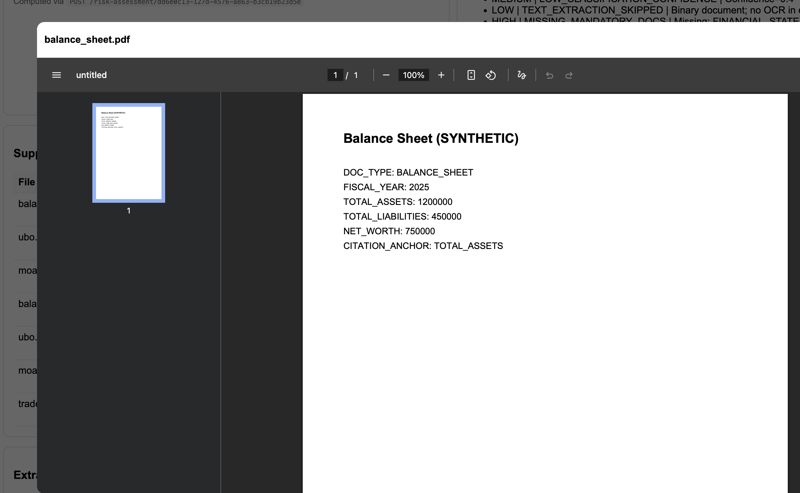

#### Human-In-The-Loop Review And Confirm (PDF)
[Open Review & Confirm UI PDF](DiagramsAndScreenshots/KYB_Review_Confirm_HumaninLoop.pdf)

### API Evidence

#### Swagger API Overview (All Endpoints)
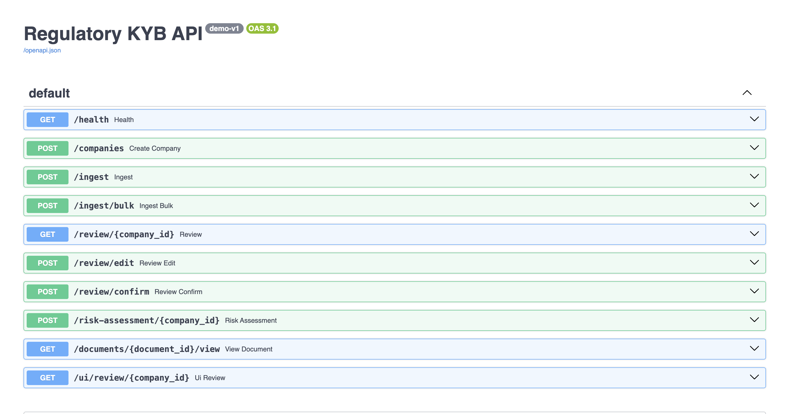

## API Details (Request And Sample Response)

Base URL examples:
- Local: `http://localhost:8000`
- Azure: `https://ca-dfm-kyb-risk-uae01.wittybush-9a1faafa.uaenorth.azurecontainerapps.io`
- API Swagger: `https://ca-dfm-kyb-risk-uae01.wittybush-9a1faafa.uaenorth.azurecontainerapps.io/docs#/`

### 1) Health
**GET** `/health`

Sample response:
```json
{
  "status": "ok",
  "utc": "2026-03-05T11:20:11.123456+00:00",
  "version": "demo-v1"
}
```

### 2) Create Company
**POST** `/companies` (form-data)

Sample request:
```bash
curl -X POST "$BASE/companies" \
  -F "external_ref=EXT-001" \
  -F "company_name=Acme Trading LLC"
```

Sample response:
```json
{
  "company_id": "9b9fa2f6-80d0-4b9d-9c3e-2e511d2fa0bb",
  "correlation_id": "25387f9a-a722-4f15-a120-cf48d752f74d"
}
```

### 3) Ingest Document
**POST** `/ingest` (form-data)

Sample request:
```bash
curl -X POST "$BASE/ingest" \
  -F "company_id=9b9fa2f6-80d0-4b9d-9c3e-2e511d2fa0bb" \
  -F "file=@SourceCode/synthetic_data/case_01/trade_license.pdf"
```

Sample response:
```json
{
  "status": "ok",
  "company_id": "9b9fa2f6-80d0-4b9d-9c3e-2e511d2fa0bb",
  "document_id": "7716f4ce-3968-417e-903f-cd14d916b795",
  "correlation_id": "79e34335-f8f7-404f-98a7-08f697463433"
}
```

### 4) Bulk Ingest Documents
**POST** `/ingest/bulk` (form-data)

Sample request:
```bash
curl -X POST "$BASE/ingest/bulk" \
  -F "company_id=9b9fa2f6-80d0-4b9d-9c3e-2e511d2fa0bb" \
  -F "files=@SourceCode/synthetic_data/case_01/trade_license.pdf" \
  -F "files=@SourceCode/synthetic_data/case_01/financial_statements.pdf"
```

Sample response:
```json
{
  "company_id": "9b9fa2f6-80d0-4b9d-9c3e-2e511d2fa0bb",
  "total_files": 2,
  "results": [
    {
      "file_name": "trade_license.pdf",
      "status": "success",
      "document_id": "7716f4ce-3968-417e-903f-cd14d916b795"
    },
    {
      "file_name": "financial_statements.pdf",
      "status": "success",
      "document_id": "fbcf29ba-0645-46bb-a58f-a3450ea3e7e3"
    }
  ]
}
```

### 5) Review Snapshot
**GET** `/review/{company_id}`

Sample request:
```bash
curl "$BASE/review/9b9fa2f6-80d0-4b9d-9c3e-2e511d2fa0bb"
```

Sample response (truncated):
```json
{
  "unified": {
    "companyProfile": {
      "companyId": "9b9fa2f6-80d0-4b9d-9c3e-2e511d2fa0bb",
      "companyName": "Acme Trading LLC"
    }
  },
  "exceptions": [],
  "manualEdits": [],
  "latestRiskAssessment": null
}
```

### 6) Apply Manual Edit
**POST** `/review/edit` (form-data)

Sample request:
```bash
curl -X POST "$BASE/review/edit" \
  -F "company_id=9b9fa2f6-80d0-4b9d-9c3e-2e511d2fa0bb" \
  -F "field_path=financialIndicators.auditStatus" \
  -F "new_value=AUDITED" \
  -F "reason=Verified with submitted statements" \
  -F "reviewer=compliance.user"
```

Sample response:
```json
{
  "status": "ok",
  "edit_id": "fb1e5a86-56fd-45fb-a9f4-e43c715a9d72",
  "correlation_id": "2758df13-4f4a-4f72-bba0-a6ac63e18b04"
}
```

### 7) Human Review Confirmation
**POST** `/review/confirm` (form-data)

Sample request:
```bash
curl -X POST "$BASE/review/confirm" \
  -F "company_id=9b9fa2f6-80d0-4b9d-9c3e-2e511d2fa0bb" \
  -F "reviewer=compliance.user"
```

Sample response:
```json
{
  "status": "review_finalized",
  "attestation": "I confirm that I have reviewed the extracted information, supporting documents, and risk indicators. I understand that submission constitutes an attestation for regulatory purposes.",
  "utc": "2026-03-05T11:35:41.121212+00:00",
  "correlation_id": "4d5d76d8-7f2e-4ec6-a131-e86d1d8b0ac7"
}
```

### 8) Run Risk Assessment
**POST** `/risk-assessment/{company_id}`

Sample request:
```bash
curl -X POST "$BASE/risk-assessment/9b9fa2f6-80d0-4b9d-9c3e-2e511d2fa0bb"
```

Sample response:
```json
{
  "company_id": "9b9fa2f6-80d0-4b9d-9c3e-2e511d2fa0bb",
  "assessment_id": "18a86141-fbc0-4459-b220-8507a486f8c2",
  "score": 68,
  "risk_band": "MEDIUM",
  "risk_drivers": [
    "Missing net profit/loss",
    "Missing mandatory documents: FINANCIAL_STATEMENT"
  ],
  "confidence_level": "MEDIUM",
  "risk_report_blob_path": "9b9fa2f6-80d0-4b9d-9c3e-2e511d2fa0bb/18a86141-fbc0-4459-b220-8507a486f8c2.json",
  "correlation_id": "f8f0b948-d8fb-442c-abfd-b4f31f4cd6ca"
}
```

### Audit Trail Evidence

All critical workflow actions are recorded in structured audit tables for traceability and compliance review.

| Critical Action | Audit Evidence |
|---|---|
| Document ingestion logged | 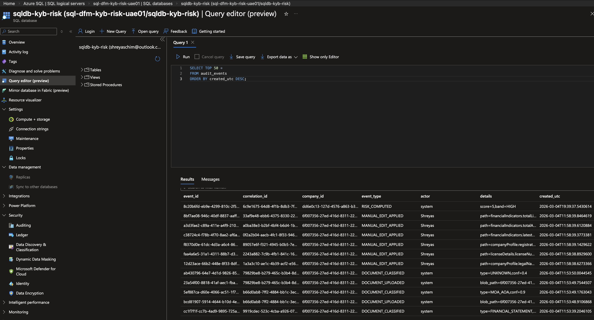 |
| Manual human edits tracked | 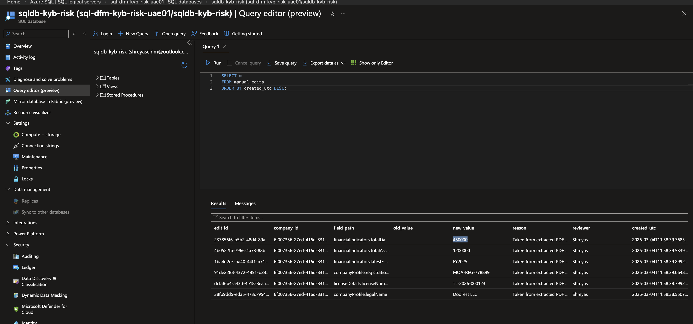 |
| Risk scoring execution recorded | 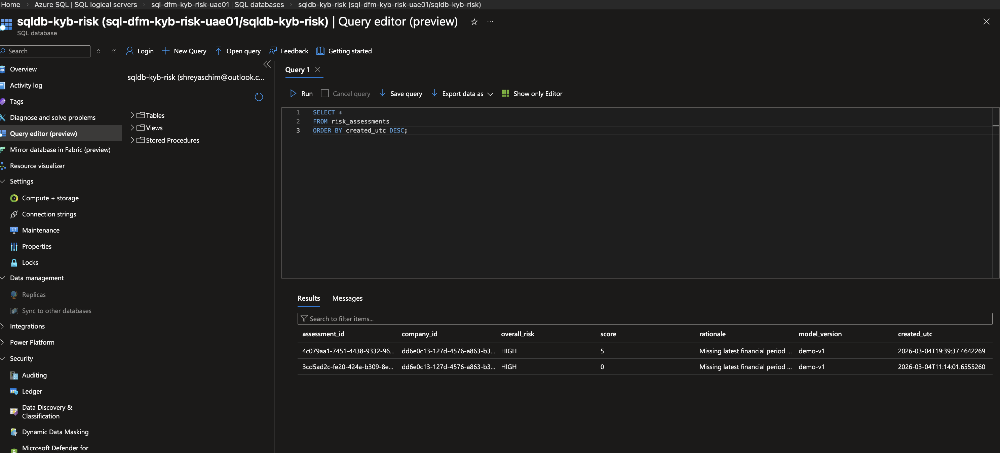 |

## Implemented Azure Scope

- Resource Group: `rg-dfm-kyb-risk-uae`
- Region: `UAE North`
- Compute: Azure Container Apps (`ca-dfm-kyb-risk-uae01`, container `kyb-api`, FastAPI, port `8000`)
- Identity: System Assigned Managed Identity
- Secrets: Azure Key Vault (`kv-dfm-kyb-risk-uae01`, secret `sql-connection-string`)
- Database: Azure SQL Server (`sql-dfm-kyb-risk-uae01`) and SQL DB (`sqldb-kyb-risk`)
- Document Storage: Azure Storage Account (`stdfmkybriskuae01`) with containers `raw`, `processed`, `outputs`
- Image Pipeline: Azure Container Registry (`acrdfmkybriskuae01`, image `kyb-api:v1`)

Note: Observability tools such as Azure Application Insights were intentionally not used in this implementation to keep the architecture minimal. The primary regulatory audit trail is maintained within the SQL audit tables.

## High-Level Flows

- `Compliance User -> Container App` (`HTTPS REST API`)
- `Container App -> Key Vault` (`Managed Identity Authentication`, `GetSecret(sql-connection-string)`)
- `Container App -> SQL Database` (`Secure SQL Connection (TLS)`)
- `Container App -> Blob Storage` (`Document Read / Write`)
- `ACR -> Container App` (`AcrPull`)
- `Container App -> Application Insights` (`Telemetry / Logs`)
- `Container App -> SQL Database` (`Audit Event Logging`)

## Enterprise Architecture Extension (Future State)

This solution is designed to evolve into a full Maker-Checker regulatory workflow platform.

### Role-Based Access & SSO

In production, authentication would integrate with Azure Entra ID (SSO via OIDC).  
Role-based access control (RBAC) would enforce Least-Privilege principles:

- MAKER - Document upload & scoring trigger
- CHECKER - Review and decision authority
- COMPLIANCE_ADMIN - Override & governance
- AUDITOR - Read-only finalized cases

Authorization would be enforced via JWT claim validation at API layer.

### Maker-Checker Workflow

Proposed case lifecycle:

`INGESTED -> SCORING_COMPLETE -> PENDING_REVIEW -> APPROVED | REJECTED`

Rules:
- Makers cannot approve their own submissions.
- All approvals require reviewer identity & remarks.
- Finalized cases are immutable and read-only.

### Audit & Traceability

Each lifecycle stage is linked via `correlation_id`, enabling:

- Full traceability from ingestion to approval
- Immutable audit trail in `audit_events`
- Explainable scoring stored in `risk_assessments`

This architecture aligns with AML/KYB governance expectations.

## Repository Structure

```text
KYB-Financial-Risk-Assessment-Azure/
   SourceCode/
      app/
         main.py
         db.py
         storage.py
         kv.py
      scripts/
         generate_synthetic_docs_uae_cases.py
         README.md
      synthetic_cases/
         case_01...case_10
      tests/
         test_health.py
         test_e2e_api.py
         conftest.py
   DiagramsAndScreenshots/
      architecture.png
      screenshots/
  README.md
  SECURITY.md
  dockerfile
  requirements.txt
  pytest.ini
  LICENSE
  .gitignore
```

## Explainable Risk Scoring (Design Intent)

The assignment scope is aligned to deterministic, explainable scoring:
- Numeric financial risk score and mapped risk band (`Low`/`Medium`/`High`)
- Explicit risk drivers (for example profitability, leverage, missing/old statements, audit status)
- Conservative defaults when data is missing or ambiguous
- Human-in-the-loop review and final attestation

## Assumptions And Tradeoffs

- Data is synthetic and non-PII for assessment execution.
- The design prioritizes auditability, traceability, and security controls over ML complexity.
- Managed Identity and Key Vault are used to avoid embedded credentials.
- Low-cost Azure service tiers are assumed for short-lived evaluation environments.

## Security

Security controls, handling requirements, and reporting guidance are documented in [SECURITY.md](SECURITY.md).
